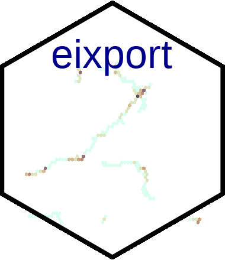

<!-- README.md is generated from README.Rmd. Please edit that file -->

# eixport 

[](https://travis-ci.org/atmoschem/eixport)[](https://ci.appveyor.com/project/Schuch666/eixport)
[](https://codecov.io/github/atmoschem/eixport?branch=master)
[](https://zenodo.org/badge/latestdoi/106145968)
[](http://cran.r-project.org/web/packages/eixport)
[](http://cran.r-project.org/package=eixport)
[](https://doi.org/10.21105/joss.00607)
[](https://cran.r-project.org/web/checks/check_results_eixport.html)
[](https://github.com/atmoschem/eixport)

## Exporting emissions to atmospheric models, eixport: 0.6.0

Emissions are mass that affects atmosphere in complex ways, not only
physical, but also, in the health of humans, ecosystems, economically,
etc.

There are several models whose inputs are emissions, such as
[R-Line](https://www.cmascenter.org/r-line/) or
[WRF-Chem](https://ruc.noaa.gov/wrf/wrf-chem/). This R-Package provide
functions to read emissions from
[VEIN](https://github.com/ibarraespinosa/vein) and from other models in
different formats and export the emissions into the appropriate format
suitable to other models.

## Install

To install the [CRAN](https://CRAN.R-project.org/package=eixport)
version:

``` r
install.packages("eixport")
```

To install the development version:

``` r
devtools::install_github("atmoschem/eixport")
```

## Some functions:

- [get_edgar](https://atmoschem.github.io/eixport/reference/get_edgar.html):
  Download EDGAR emissions data.
- [to_rline](https://atmoschem.github.io/eixport/reference/to_rline.html):
  Export emissions to other formats
- [to_wrf](https://atmoschem.github.io/eixport/reference/to_wrf.html):
  Combine total/spatial/temporal/split and write emission to file
- [to_brams_spm](https://atmoschem.github.io/eixport/reference/to_brams_spm.html):
  inputs for SPM BRAMS
- [wrf_profile](https://atmoschem.github.io/eixport/reference/wrf_profile.html):
  Create spatial profile for WRF-Chem
- [wrf_create](https://atmoschem.github.io/eixport/reference/wrf_create.html):
  Create emission files to the WRF-Chem
- [wrf_plot](https://atmoschem.github.io/eixport/reference/wrf_plot.html):
  simple but useful plot
- [wrf_get](https://atmoschem.github.io/eixport/reference/wrf_get.html):
  Read variables
- [wrf_put](https://atmoschem.github.io/eixport/reference/wrf_put.html):
  Write variables
- [to_as4wrf](https://atmoschem.github.io/eixport/reference/to_as4wrf.html):
  Create WRF-Chem inputs using NCL scrip AS4WRF.ncl.
- [to_munich](https://atmoschem.github.io/eixport/reference/to_munich.html):
  To generate inputs for MUNICH model.

### Summary

``` r
library(eixport)
#> The legacy packages maptools, rgdal, and rgeos, underpinning the sp package,
#> which was just loaded, will retire in October 2023.
#> Please refer to R-spatial evolution reports for details, especially
#> https://r-spatial.org/r/2023/05/15/evolution4.html.
#> It may be desirable to make the sf package available;
#> package maintainers should consider adding sf to Suggests:.
#> The sp package is now running under evolution status 2
#>      (status 2 uses the sf package in place of rgdal)
file = paste0(system.file("extdata", package = "eixport"),"/wrfinput_d02")
wrf_summary(file = file)
#>   |                                                                              |                                                                      |   0%  |                                                                              |=======================                                               |  33%  |                                                                              |===============================================                       |  67%  |                                                                              |======================================================================| 100%
#>                Min.       1st Qu.        Median          Mean       3rd Qu.
#> Times  1.312178e+09  1.312178e+09  1.312178e+09  1.312178e+09  1.312178e+09
#> XLAT  -2.438538e+01 -2.405025e+01 -2.370471e+01 -2.370379e+01 -2.335773e+01
#> XLONG -4.742899e+01 -4.696930e+01 -4.650305e+01 -4.650304e+01 -4.603427e+01
#>                Max.        sum
#> Times  1.312178e+09         NA
#> XLAT  -2.301877e+01  -76160.28
#> XLONG -4.558643e+01 -149414.28
```

### Attributes as data.frame

``` r
file = paste0(system.file("extdata", package = "eixport"),"/wrfinput_d02")
f <- wrf_meta(file)
names(f)
#> [1] "global" "vars"
head(f$global)
#>                          att                                       vars
#> 1                      TITLE  OUTPUT FROM REAL_EM V3.9.1.1 PREPROCESSOR
#> 2                 START_DATE                        2011-08-01_00:00:00
#> 3      SIMULATION_START_DATE                        2011-08-01_00:00:00
#> 4   WEST-EAST_GRID_DIMENSION                                         64
#> 5 SOUTH-NORTH_GRID_DIMENSION                                         52
#> 6  BOTTOM-TOP_GRID_DIMENSION                                         35
head(f$vars)
#>    vars MemoryOrder                 description        units stagger FieldType
#> 1  XLAT          XY LATITUDE, SOUTH IS NEGATIVE degree north               104
#> 2 XLONG          XY LONGITUDE, WEST IS NEGATIVE  degree east               104
```

## Paper on Journal of Open Source Software (JOSS)

<https://doi.org/10.21105/joss.00607>

    @article{eixport,
        title = {eixport: An R package to export emissions to atmospheric models},
        journal = {The Journal of Open Source Software},
        author = {Sergio Ibarra-Espinosa and Daniel Schuch and Edmilson {Dias de Freitas}},
        year = {2018},
        doi = {10.21105/joss.00607},
        url = {http://joss.theoj.org/papers/10.21105/joss.00607},
      }

<span class="__dimensions_badge_embed__"
data-doi="10.21105/joss.00607"></span>
<script async src="https://badge.dimensions.ai/badge.js" charset="utf-8"></script>

## Contributing

Please, read
[this](https://github.com/atmoschem/eixport/blob/master/CONTRIBUTING.md)
guide. Contributions of all sorts are welcome, issues and pull requests
are the preferred ways of sharing them. When contributing pull requests,
please follow the [Google’s R Style
Guide](https://google.github.io/styleguide/Rguide.xml). This project is
released with a [Contributor Code of
Conduct](https://github.com/atmoschem/eixport/blob/master/CODE_OF_CONDUCT.md).
By participating in this project you agree to abide by its terms.
